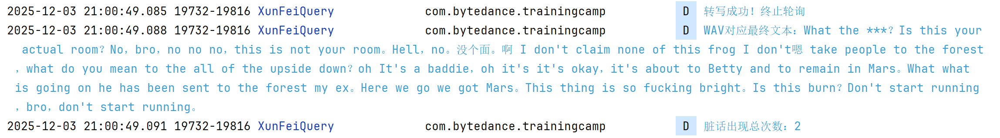

# 视频播放和口播内容识别器


## 项目简介

本项目是一个基于**垂直滑动视频播放 + 音频转写 + 脏话检测**的 Android 应用，支持仿抖音式垂直滑动切换视频，从本地`assets`文件夹加载视频播放，并自动提取对应音频文件，通过讯飞开放平台的录音文件转写接口将音频转为文本，最终检测文本中的脏话并统计次数。

## 项目结构

```
app
├── manifests              # Android配置文件目录
│   └── AndroidManifest.xml # 应用权限、启动页配置
├── java
│   └── com.bytedance.trainingcamp
│       ├── MainActivity.java      # 应用主Activity，负责ViewPager2初始化和视频列表配置
│       ├── VideoAdapter.java      # ViewPager2适配器，管理视频Fragment的创建和复用
│       ├── VideoFragment.java     # 视频播放核心Fragment，负责视频加载、播放控制、音频转写触发
│       ├── XunFei.java            # 讯飞接口封装类，负责音频上传、转写结果查询、文本解析
│       ├── SwearwordChecker.java  # 脏话检测工具类，提供文本脏话匹配、次数统计
├── assets                  # 静态资源目录（视频+音频文件）
│   ├── video1.mp4          # 视频文件1
│   ├── video1.wav          # 视频1对应的音频文件（用于转写）
│   ├── video2.mp4          # 视频文件2
│   └── video2.wav          # 视频2对应的音频文件（用于转写）
└── res                     # 资源目录
    ├── drawable            # 图片/XML资源（如背景、图标）
    ├── layout              # 布局文件
    │   ├── main_activity.xml  # 主Activity布局（包含ViewPager2）
    │   └── video_player.xml   # 单个视频播放布局（包含SurfaceView）
    ├── mipmap              # 应用图标资源（mdpi/xhdpi/xxhdpi等）
    └── values              # 配置文件
        ├── strings.xml     # 字符串资源
        ├── styles.xml      # 应用样式配置
        └── colors.xml      # 颜色资源
```


## 核心功能

###仿抖音垂直滑动视频播放

- 基于`ViewPager2`实现垂直滑动切换视频，支持无缝连续播放
- 适配器`VideoAdapter`管理多个`VideoFragment`，实现 Fragment 复用
- 视频自动加载`assets`目录资源，支持播放 / 暂停控制（点击视频触发）

### 音频自动转写

- 每个视频播放时，自动匹配对应同名 WAV 音频文件（如`video1.mp4`→`video1.wav`）

- 通过`XunFei`类封装讯飞开放平台接口，详情见讯飞开发者文档，支持中英日韩等14终语言

  [录音文件转写（标准版） | 讯飞开放平台文档中心](https://www.xfyun.cn/doc/asr/ifasr_new/API.html#_1%E3%80%81%E6%96%87%E4%BB%B6%E4%B8%8A%E4%BC%A0)

  ```
  // 请求地址：
  1、文件上传：http[s]: //raasr.xfyun.cn/v2/api/upload
  2、获取结果：http[s]: //raasr.xfyun.cn/v2/api/getResult
  ```

  - 音频文件上传至讯飞服务器
  - 分梯度轮询转写结果（最大 15 分钟，30 秒 / 次），确保获取转写完成状态
  - 解析嵌套 JSON 格式的转写结果，提取核心文本

### 脏话检测与结果展示

- `SwearwordChecker`内置中英文脏话词库，支持忽略大小写匹配
- 统计文本中脏话出现次数，并通过日志打印在终端

## 使用说明

### 资源准备

1. 开发环境

   下载并安装 [Android Studio](https://developer.android.com/studio)，打开项目后，Android Studio 会自动下载项目所需的 Gradle 版本、SDK 依赖，无需手动配置

2. 本地视频

   将视频文件（格式：MP4）和对应音频文件（格式：WAV）放入`assets`目录，需满足：视频与音频文件名前缀一致（仅后缀不同），例：`video1.mp4` ↔ `video1.wav`；音频文件要求：采样率 16k、位深 16bit、单声道（符合讯飞转写接口标准）

### 接口配置

在`XunFei.java`中替换讯飞开放平台的`APP_ID`和`SECRET_KEY`（需提前在讯飞开放平台申请「录音文件转写」服务[控制台-讯飞开放平台](https://console.xfyun.cn/services/lfasr)）：

```
private static final String APP_ID = "你的讯飞APP_ID";
private static final String SECRET_KEY = "你的讯飞SECRET_KEY";
```

### 视频列表配置

在`MainActivity.java`中修改`videos`数组，添加 / 删除视频文件名称，实现视频列表更新：

```
// 示例：添加3个视频
String[] videos = {"video1.mp4", "video2.mp4", "video3.mp4"};
```

### 运行效果

- 启动应用后，默认显示第一个视频并自动播放

- 垂直滑动屏幕切换下一个 / 上一个视频

- 点击视频可暂停 / 继续播放

- 音频转写完成后，自动在终端展示结果：

  

## 注意事项

### 讯飞接口限制

- 音频文件限制：时长≤5 小时，大小≤500M
- 转写结果保留 72 小时，超过后无法查询
- 接口调用频率限制：避免短时间内频繁上传 / 查询，本项目已通过 30 秒间隔轮询优化

### 权限说明

本项目仅访问本地`assets`资源，无需申请网络之外的额外权限（Android 9.0 + 需在`AndroidManifest.xml`中添加网络权限）：

```
<uses-permission android:name="android.permission.INTERNET" />
```

### 性能优化

- 视频播放：生命周期绑定（`onResume`继续播放、`onPause`释放资源），防止内存泄漏
- 异步操作：音频上传、转写查询均在子线程执行，避免阻塞 UI 线程
- Fragment 复用：`ViewPager2`默认开启 Fragment 复用，提升滑动流畅度